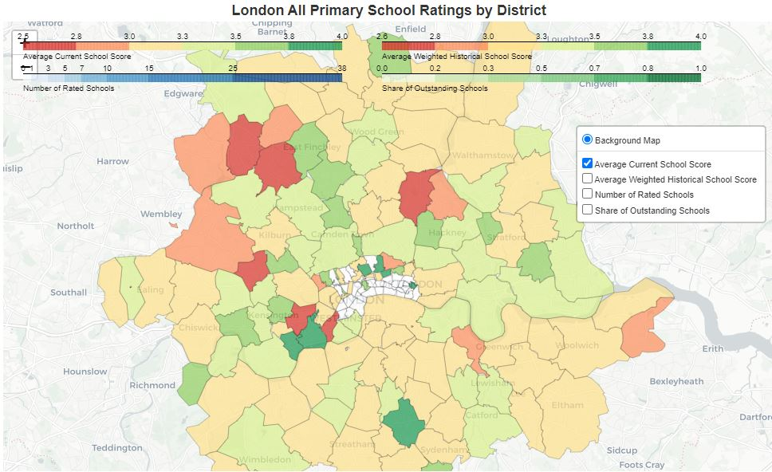
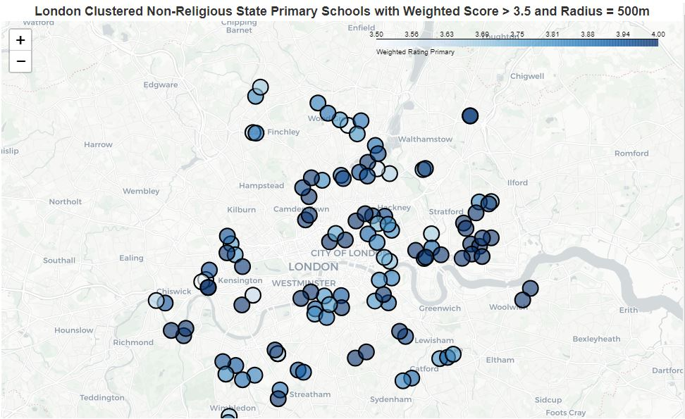

# London Primary Schools Analysis

This repo contains code to scrape Ofsted rating data and code to create maps to locate areas with top quality primary schools. I did this analysis for my personal use, but, hopefully, it can help other people to make data-driven decisions in selecting areas with good primary schools in London.

The analysis was done in the following order:
1) Scraped London districts from https://www.doogal.co.uk/london_postcodes.
2) Scraped schools metadata from Ofsted website (https://reports.ofsted.gov.uk). To do this, I iterated over all London districts within 3 miles radius and "primary" filter.
3) I removed all duplicated and non-London schools. Then, I iterated over all remaining schools and collected their historical reports. 
4) I used Google Maps API to match school address from metadata to school's lattitude and longitude.
5) I downloaded district geo shapes from https://www.opendoorlogistics.com/data/ and kept only London districts.
6) I created Folium maps to show average school scores by district. See maps/district/ maps. Here is the current average rating by district map:

7) I created maps that show individual maps with multiple filters for outstanding schools. See maps/individual/ maps. Here is the map that shows schools with exponentially smoothed historical average scores higher than 3.5:
